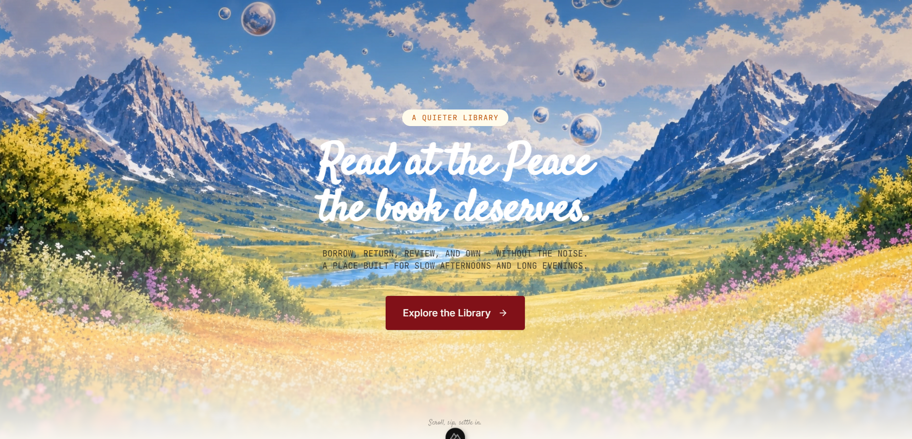

# Read in Peace — Frontend



Nuxt 3 SSR application with Vue 3 Composition API, Pinia, Tailwind CSS v4, and shadcn-vue.

## Tech stack

- **Framework:** Nuxt 3 (SSR), Vue 3 `<script setup lang="ts">`
- **State:** Pinia (setup-function stores)
- **Auth:** Better Auth client (`better-auth/vue`) with reactive `useSession()`
- **Cart:** Client-side Pinia store with manual localStorage persistence
- **Discounts:** 3-stage pipeline utility (quantity tier, category bonus, every $100)
- **Styling:** Tailwind CSS v4 (CSS-first config, `@tailwindcss/vite` plugin), OKLCH color tokens, dark mode via `.dark` class
- **UI:** Custom button with CVA variants (`components/ui/button/`), lucide-vue-next icons
- **Social share:** `@stefanobartoletti/nuxt-social-share`
- **Toasts:** `vue-sonner`
- **Build:** Vite 7, Nitro server

## Commands

| Command | Description |
|---|---|
| `npm run dev` | Start dev server (port 3000) |
| `npm run build` | Production build |
| `npm run generate` | Static export |
| `npm run preview` | Preview production build |

## Project structure

```
frontend/
├── app.vue                    # Root component (NuxtLayout + NuxtPage)
├── nuxt.config.ts             # Nuxt config (modules, runtimeConfig, Tailwind, Google Fonts)
├── assets/css/main.css        # Tailwind v4 with @theme color tokens, cover sprite CSS
├── components/
│   ├── ui/button/
│   │   ├── Button.vue         # shadcn-style button with CVA variants
│   │   ├── variants.ts        # Shared button CVA (importable by non-button elements)
│   │   └── index.ts           # Barrel export
│   ├── Nav.vue                # Sticky nav with search, cart badge, profile button
│   ├── BottomDock.vue         # Fixed bottom navigation dock
│   ├── CoverImage.vue         # Book cover with sprite-sheet crop positioning
│   ├── BookHero.vue           # Book title, author, rating, description, save/scroll
│   ├── BookBorrowCard.vue     # Borrow/purchase sidebar with cart integration
│   ├── BookReviews.vue        # Reviews section with star input, textarea, ReviewItem
│   ├── ReviewItem.vue         # Individual review with likes, replies, reply form
│   ├── AuthModal.vue          # Sign-in / Sign-up modal
│   ├── ReviewModal.vue        # Modal for writing a review
│   ├── ActiveLoans.vue        # Active loans section with return/write review/buy
│   ├── NewArrivals.vue        # New arrivals grid with borrow/buy, search filter
│   ├── ReaderFeed.vue         # Social feed posts with like/reply
│   └── YearlyProgress.vue     # Reading goal progress bar
├── composables/
│   └── useFlash.ts            # Global flash notice with auto-clear
├── layouts/
│   └── default.vue            # Default layout (BottomDock, Toaster, flash notice)
├── pages/
│   ├── index.vue              # Landing page with video background
│   ├── feed.vue               # Library feed (loans, arrivals, reader feed, progress)
│   ├── cart.vue               # Shopping cart with quantity controls, checkout
│   └── book/[id].vue          # Book detail (cover, hero, borrow card, reviews)
├── stores/
│   ├── auth.ts                # Auth state (session, admin mode, auth modal)
│   └── cart.ts                # Cart items (localStorage CRUD, checkout)
├── lib/
│   └── auth-client.ts         # Better Auth client
├── utils/
│   └── discount.ts            # Discount pipeline (tier, category bonus, every $100)
├── server/
│   └── api/[...].ts           # H3 proxy forwarding /api/* to NestJS backend
└── public/                    # Static assets (images, etc.)
```

## Architecture

### Pages as thin containers

Route pages delegate rendering to child components.

| Page | Child components |
|---|---|
| `index.vue` | — (self-contained landing) |
| `feed.vue` | Nav, ActiveLoans, NewArrivals, YearlyProgress, ReaderFeed, ReviewModal |
| `book/[id].vue` | Nav, CoverImage, BookHero, BookBorrowCard, BookReviews |
| `cart.vue` | Nav, CoverImage |

### Data flow

```
Page ──► child components (props: book, flash)
  │
  ├── BookHero (props: book, flash)
  ├── BookBorrowCard (props: book, bookId, flash; cartStore.addItem)
  └── BookReviews (props: flash; owns reviews state internally)

Cart flow:
  Buy click ──► cartStore.addItem() ──► checkout
  │                                    │
  └── localStorage ◄───────────────────┘
                              (watch + persist)
```

### Auth

- `better-auth/vue` provides `createAuthClient()` with `useSession()` (reactive Vue ref)
- `stores/auth.ts` watches session changes and exposes `signedIn`, `user`, `adminMode`
- All `/api/*` requests are proxied via `server/api/[...].ts` to NestJS backend

### Styling

- Tailwind v4 CSS-first config via `main.css` with `@theme` design tokens
- OKLCH color tokens mapped to CSS custom properties
- Dark mode via `.dark` class on `<html>`

### Path alias

`~` for all project imports (`~/stores/auth`, `~/components/Nav.vue`).
